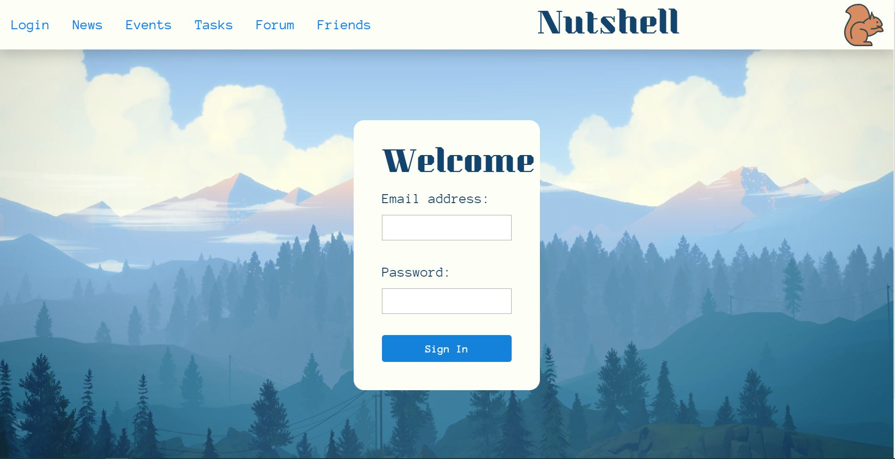

This project was bootstrapped with [Create React App](https://github.com/facebook/create-react-app).

# React Nutshell Social Media App
## Brought to You By Shell-Nut-Zippers

### How To Download & Run Nutshell:

1. Choose or create a local directory to store Nutshell in & clone this repository into it

2. Install dependencies using `npm install`

3. Install json-server globally from npm

4. From root directory run `json-server -p 5002 api/nutshell.json`

4. Run `npm start` and open http://localhost:3000 to view React Nutshell in the browser. The page will automatically reload if changes are made to the code and build errors and lint warnings occur in the console as code is written.

### User Guide:
1. Register or log in with an email and password

2. Use the navigation bar to toggle between app features: News, Events, Tasks, Forum, Friends

3. Log out to end user session.

### React Nutshell Features:

1. News -- User can see, add, delete, and edit news articles with title, synopsis, and URL

2. Events -- User can see, add, delete, and edit upcoming events with title, date, and location. The most upcoming event is highlighted.

3. Tasks -- User can see, add, delete, and edit tasks with title & due date. Tasks can be marked complete with a checkbox and it will be hidden from the list of tasks to complete, however, it is still stored in the database for reference.

4. Forum -- User can see, add, delete, and edit messages. Messages rendered show user ID and message contents.

5. Friends -- User can manage friend list in this feature. Friends can be searched, added, and removed from the friend list.